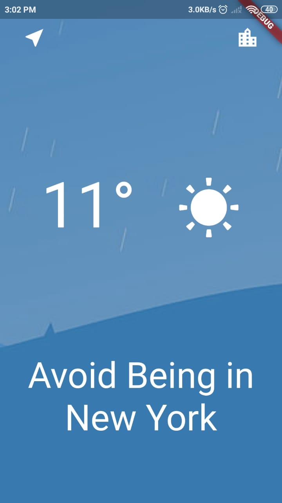

# Weather App

The applicattion displays the weather of the user-location. It automatically fetches the location of the user and displays the weather info such as the temperature and weather condition. The app also displays the weather information of locations entered manually.

<pre>                                 </pre>
<pre>                                 </pre>
